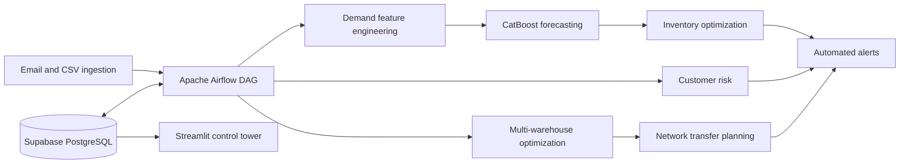

# Supply Chain Intelligence and Airflow Orchestration Platform

An end-to-end supply-chain data and machine-learning platform orchestrated by
Apache Airflow. The pipeline ingests operational files, engineers demand
features, trains forecasts, calculates inventory and warehouse recommendations,
and publishes alerts. A Streamlit control tower presents the resulting data.

## Architecture



## Production services

The production Compose stack contains:

- `airflow-webserver`: authenticated Airflow UI and API
- `airflow-scheduler`: 30-minute supply-chain DAG scheduler
- `airflow-init`: metadata migration and account creation
- `postgres`: private Airflow metadata database
- `dashboard`: Streamlit analytics application
- `caddy`: HTTPS reverse proxy for the two public applications

Supabase is the business-data store. The Compose PostgreSQL container is used
only for Airflow metadata.

## Deploy to an Ubuntu VPS

### 1. Prepare the repository safely

The local `.env` must never be published. If it has previously been committed,
rotate every database, Supabase, email, Telegram, and Airflow credential before
making the repository public. Then remove it from Git's index:

```bash
git rm --cached .env
git add .gitignore .env.example
git commit -m "Prepare production deployment"
git push
```

Removing the file from the latest commit does not invalidate leaked secrets;
credential rotation is mandatory.

### 2. Provision the server and DNS

Create an Ubuntu server with at least 2 vCPUs and 4 GB RAM. Install Docker
Engine with the Compose plugin, then allow inbound TCP ports 22, 80, and 443.
Do not expose ports 5432, 8080, or 8501.

Create two DNS `A` records pointing to the server's public IP:

```text
airflow.yourdomain.com
dashboard.yourdomain.com
```

Caddy obtains and renews TLS certificates after the records resolve.

### 3. Configure production secrets

On the server:

```bash
git clone https://github.com/rajashekhar1242/supply_chain.git
cd supply_chain
cp .env.example .env
chmod 600 .env
```

Generate the Airflow keys:

```bash
docker run --rm apache/airflow:2.9.2-python3.12 python -c "from cryptography.fernet import Fernet; print(Fernet.generate_key().decode())"
openssl rand -hex 32
```

Put the first output in `AIRFLOW__CORE__FERNET_KEY` and the second in
`AIRFLOW__WEBSERVER__SECRET_KEY`. Edit every remaining value in `.env`:

- Set `AIRFLOW_DOMAIN` and `DASHBOARD_DOMAIN` to the DNS names.
- Use unique admin, demo, and PostgreSQL passwords. Use a URL-safe or hex
  PostgreSQL password because it is embedded in a connection URI.
- Set the Supabase URL and service-role key for Airflow analytics tasks.
- Set `DATABASE_URL` to the Supabase pooler connection string and append
  `sslmode=require`.
- Set IMAP/SMTP credentials, preferably dedicated app passwords.

The Supabase schema and source data must already exist before the DAG and
dashboard queries can succeed.

### 4. Start the platform

```bash
docker compose config --quiet
docker compose up -d --build
docker compose ps
```

Watch initialization and scheduler logs:

```bash
docker compose logs -f airflow-init
docker compose logs -f airflow-scheduler
```

Open the Airflow URL, sign in as the administrator, confirm that
`supplychain_enterprise_pipeline` has no import errors, and trigger one manual
run. After it succeeds, verify all dashboard tabs.

The `demo` account has Airflow's read-only `Viewer` role and is suitable for a
portfolio reviewer. Keep the administrator account private.

### 5. Update or restart

```bash
git pull
docker compose up -d --build
```

Useful checks:

```bash
docker compose ps
docker compose logs --tail=200 airflow-scheduler
docker compose exec airflow-webserver airflow dags list-import-errors
```

Back up the `postgres_data` Docker volume and the Supabase project according to
your recovery requirements. The `pipeline_data` volume preserves downloaded and
processed ingestion files across container replacements.

## Local development

Copy `.env.example` to `.env`, replace its values, and run:

```bash
docker compose up --build
```

For local-only access without public DNS, use a development Caddy configuration
or temporarily publish the Airflow and dashboard ports. Do not commit those
production overrides.

## Portfolio links

Include both interfaces on a resume or project page:

```text
Airflow pipeline: https://airflow.yourdomain.com
Analytics dashboard: https://dashboard.yourdomain.com
Source code: https://github.com/rajashekhar1242/supply_chain
```

Share only the read-only Airflow demo credentials privately with reviewers.
